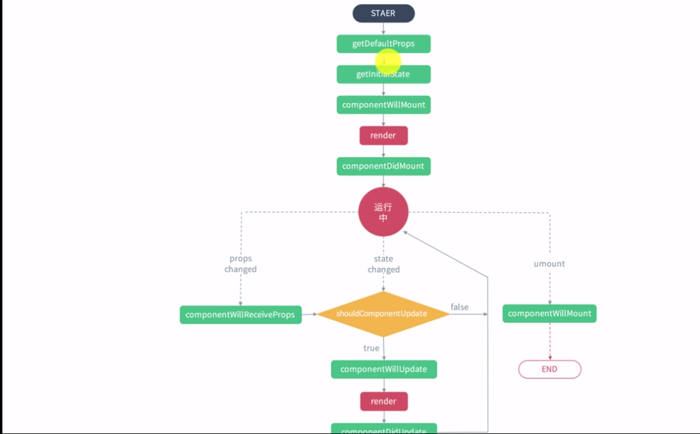
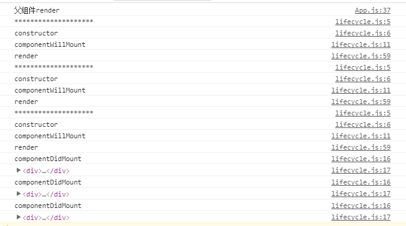

# React组件生命周期

## 组件生命周期示例图
		

**如图，可以把组件生命周期大致分为三个阶段：**

* 装载过程：是组件第一次绘制阶段
* 更新过程：是组件在运行和交互阶段，当state或者props改变会触发组件重新渲染
* 卸载过程：是组件卸载消亡的阶段 

## 一、装载过程
**当组件第一次被渲染的时候依次调用函数如下：**

* constructor
* getInitialState
* getDefaultProps
* componemtWillMount
* render
* componentDidMount

### 1.、1 constructor
> Es6创建类时的构造函数，React组件中constructor不是必须的，当组件无内部状态(state)可以不定义constructor

* 初始化state
* 绑定成员函数this环境

```javascript

constructor(props) {
  super(props);
     this.state = {
         num: 1
     };
   this.handleClick = this.handleClick.bind(this)
  }
```
### 1.2、 getInitialState和getgetDefaultProps
这个两个函数只有在React.createClass()方法中有用，我们Es6通过class创建组件，所以这两个方法不会起作用，简单了解，不做重点关注

* getInitialState: 初始化state，es6中在constructor中就可以初始化state
* getDefaultProps： 设置props的初始值，是全局调用一次;es6中通过组件名.defaultProps来设置默认props

```javascript
// React.createClass

const simple = React.createClass({
	getInitialState: function(){
		return { foo: 'bar' }
    },
	getgetDefaultProps(){
		return { simpleProp: 0}
    }
})

// Es6
class Simple extends React.Component {
	constructor(props){
       super(props)
       this.state = { foo: 'bar' }
    }
}
Simple.defaultProps = {
	return { simpleProp: 0}
}
```
### 1.3、 componemtWillMount
函数调用时机是在组件创建，并初始化了状态之后，在第一次绘制 render() 之前，可以在这里做一些业务初始化操作，也可以设置组件状态。函数在整个生命周期中只被调用一次。<br>
但是通常不定义该函数，componemtWillMount触发时还没有渲染任何效果，即使调用setState()也不会重新绘制，该函数中可以做的事情都可以提到constructor中

### 1.4、 render
* 渲染的虚拟dom，所有在render获取不到DOM对象
* render是纯函数，不能修改state(否则页面死循环)，只能访问数据，不能修改数据
* render返回null或者false，不会渲染组件
### 1.5、 componemtDidMount
* 在初始化render之后只执行一次，可以获取DOM元素，发送ajax请求
* render函数被调用完后，componentDidMount不会立即调用，当render函数返回的东西已经全部被渲染装载到DOM树上componentDidMount才会被调用

```javascript

	// componemtDidMount调用时机
    render() {
      console.log("父组件render")
        return (
            <div>
                <LifeCycle ref="rLifeCycle" num={this.state.num}></LifeCycle>
                <LifeCycle ref="rLifeCycle" num={this.state.num}></LifeCycle>
                <LifeCycle ref="rLifeCycle" num={this.state.num}></LifeCycle>
            </div>
        );
    }
    
```

**如下图所示，componentDidMount不是紧跟render函数调用，而是当3个LifeCycle的render函数都被调用后才被执行**
	
## 二、更新过程
**props改变会触发组件重新渲染，依次调用函数如下：**

* componemtWillReceiveProps
* shouldComponentUpdate
* componemtWillUpdate
* render
* componentDidUpdate

**state改变会触发组件重新渲染，依次调用函数如下：**

* shouldComponentUpdate
* componemtWillUpdate
* render
* componentDidUpdate

### 2.1、componemtWillReceiveProps(nextProps)
#####当组件props发生改变，也会触发componemtWillReceiveProps
##### 父组件的render函数被调用，render函数里面被渲染的子组件就会经历更新过程，不管父组件传给子组件的props有没有改变，都会触发子组件的componentWillReciveProps函数

父组件中通过forceUpdate()让每个组件强行重新渲染，props没有发生变化，但是子组件componemtWillReceiveProps也同样执行了，详见深入浅出React和Redux p32：

	<button onClick={()=>this.forceUpdate()}>click</button>

#####输入参数 nextProps 是即将被设置的属性，旧的属性还是可以通过 this.props 来获取。在这个回调函数里面，你可以根据属性的变化，通过调用 this.setState() 来更新你的组件状态，这里调用更新状态是安全的，并不会触发额外的 render() 调用

```javascript
 componentWillReceiveProps(nextProps) {
      console.log("*******************************************************")
      console.log('componentWillReceivethis.props==',this.props)
      console.log('componentWillReceivePropsprops==',nextProps)
      this.setState({foo: 'bar'})
      console.log("componentWillReceiveProps");
  }
```
### 2.2、shouldComponentUpdate(nextProps，nextState)
* 该方法返回true更新组件，返回false组件不会更新，默认返回true
* 该方法可以提高React性能，详情深入浅出React和Redux p32-33

### 2.3、componentWillUpdate(nextProps，nextState)
* shouldComponentUpdate返回true或者调用forceUpdate之后，componentWillUpdate会被调用

## 三、卸载过程
* componentWillUnmount

## 四、参考
* [深入浅出React和Redux]()
* [https://www.cnblogs.com/gdsblog/p/7348375.html](https://www.cnblogs.com/gdsblog/p/7348375.html)
* [https://segmentfault.com/a/1190000004168886](https://segmentfault.com/a/1190000004168886)

[demo代码](https://github.com/mapingdjh/front-end-study/tree/master/js%E7%AC%94%E8%AE%B0/React/examples/lifeCycle/)
